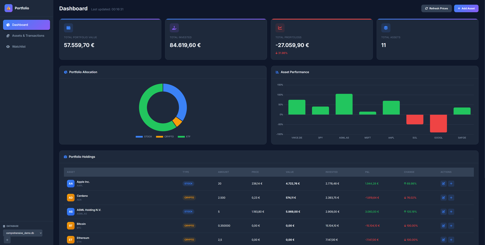

# Investment Portfolio Tracker

Personal investment tracking application with **modern web interface** and multi-currency support. Tracks stocks, ETFs, and cryptocurrencies with real-time pricing.



## Features

- 🌐 **Modern Web Interface** - Clean, responsive HTML/CSS/JS frontend
- 🔍 **Searchable Asset Dropdown** - Find stocks, ETFs, crypto easily
- 👀 **Watchlist** - Track assets without buying
- 📊 **Portfolio Analytics** - Charts, P&L tracking, allocation view
- 💱 **Multi-currency** - Auto-converts to EUR (supports USD, GBP, CHF, JPY)
- 📈 **Real-time Prices** - Yahoo Finance + CoinGecko APIs
- 💼 **Transaction Management** - Buy/sell/dividends/fees
- 🗄️ **Multiple Databases** - Switch between different portfolios

## Quick Start

```bash
git clone https://github.com/BacchusX1/investment_book.git
cd investment_book
pip install -r requirements.txt

# Launch web interface (opens in browser)
python src/web_frontend.py
```

Or use the demo launcher:
```bash
python demo.py  # Choose option 1 for web interface
```

## Screenshots

The web interface features:
- **Dashboard** - Portfolio overview, stats, charts
- **Assets & Transactions** - Manage assets and view transaction history
- **Watchlist** - Track assets you're interested in
- **Database Selector** - Switch between different database files (bottom of sidebar)

## Supported Assets

| Type | Source | Examples |
|------|--------|----------|
| **Stocks** | Yahoo Finance | AAPL, MSFT, GOOGL |
| **ETFs** | Yahoo Finance | VWCE.DE, SPY, QQQ |
| **Crypto** | CoinGecko | BTC, ETH, SOL (13,000+ coins) |
| **Bonds** | Yahoo Finance | Various bond tickers |
| **Commodities** | Yahoo Finance | GC=F (Gold), etc. |

All prices automatically converted to EUR.

## Project Structure

```
investment_book/
├── demo.py                    # Main launcher
├── src/
│   ├── backend.py            # Core logic & database
│   └── web_frontend.py       # Flask web server
├── templates/
│   └── index.html            # Modern web UI
├── docs/
│   └── handbook.md           # User documentation
├── tests/                    # Test suite
└── my_assets.db              # SQLite database (default)
```

## API Endpoints

The web interface provides a REST API:

| Endpoint | Method | Description |
|----------|--------|-------------|
| `/api/portfolio` | GET | Get portfolio summary |
| `/api/assets` | GET/POST | List/add assets |
| `/api/watchlist` | GET/POST | List/add to watchlist |
| `/api/transactions` | GET/POST | List/add transactions |
| `/api/prices/refresh` | POST | Refresh all prices |
| `/api/search/assets` | GET | Search for assets |
| `/api/databases` | GET | List available databases |
| `/api/databases/load` | POST | Switch to a different database |
| `/api/databases/create` | POST | Create a new database |

## Documentation

See [docs/handbook.md](docs/handbook.md) for detailed usage instructions.

## Testing

```bash
python demo.py  # Select option 3 for tests
```

Or run specific tests:
```bash
python tests/test_backend.py
python -m unittest tests.test_backend
```

## Troubleshooting

**Web interface won't start**: Install Flask (`pip install Flask Flask-CORS`)
**Price updates failing**: Check internet; API rate limits may apply (especially for crypto)
**Database errors**: Ensure write permissions in the project directory

## License

Open source - use and modify as needed for personal investment tracking.
