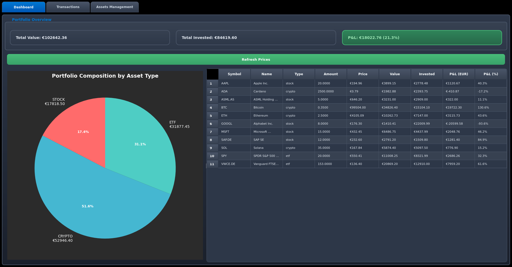

# Investment Portfolio Tracker

Personal investment tracking application with GUI and multi-currency support. Tracks stocks, ETFs, and cryptocurrencies with real-time pricing.

## Features

- GUI application with dark theme
- Multi-currency support (EUR, USD, GBP, CHF, JPY)
- Real-time prices via Yahoo Finance and CoinGecko APIs
- Portfolio analytics with P&L tracking
- Transaction history (buy/sell/dividends)
- Asset allocation charts

## Screenshot



*Portfolio dashboard showing asset allocation, P&L tracking, and real-time pricing*


*Lets you add new transactions on available assets*


*Lets you add new assets to your portfolio*

## Quick Start

```bash
git clone https://github.com/BacchusX1/investment_book.git
cd investment_book
pip install -r requirements.txt
python demo.py
```

Choose option 1 to launch the GUI application.

## Supported Assets

**Stocks & ETFs**: Global markets via Yahoo Finance (AAPL, MSFT, VWCE.DE, etc.)
**Cryptocurrencies**: 13,000+ coins via CoinGecko API (BTC, ETH, ADA, etc.)

All prices automatically converted to EUR for unified tracking.

## Project Structure

```
investment_book/
├── demo.py                    # Main launcher
├── src/
│   ├── backend.py            # Core logic
│   └── frontend.py           # GUI application
├── tests/                    # Test suite
├── example/gui/              # Alternative GUI entry
└── data/                     # Database storage
```

## Testing

Run tests to verify functionality:
```bash
python demo.py  # Select option 2
```

Or run specific tests:
```bash
python tests/test_backend.py           # Backend functionality  
python -m unittest tests.test_backend  # Unit tests
```

## Troubleshooting

**GUI won't start**: Install PySide6 (`pip install PySide6`)
**Price updates failing**: Check internet connection, API rate limits may apply
**Database errors**: Ensure write permissions in the data directory

## License

Open source - use and modify as needed for personal investment tracking.
